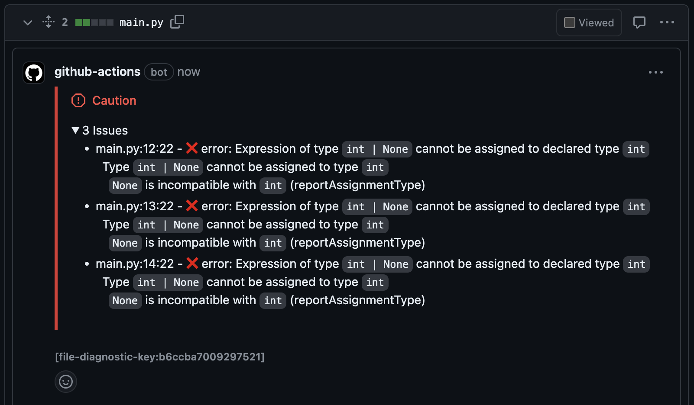

# Simple Pyright Action
Runs [pright](https://github.com/microsoft/pyright) on your pull requests!

# Features
- File-specific comments on python files with pyright issues.
  - Comments are upserted, so you don't need to worry about cluttering.
  - See [showcase](#file-specific-comments)
- _Branch Summary report_ - compare pyright stats against your pull request base.
  - See [showcase](#branch-summary-report)

# Options
```yaml
inputs:
    # Required
    github-token:
        description: "GitHub Token"
        required: true

    # Optional
    include-file-comments:
        description: "Include file-specific comments on pull requests. Comments are upserted."
        required: false
        default: "true"
    include-base-comparison:
        description: "When this is true, pyright statistics will be calculated for the whole project on both the base and head."
        required: false
        default: "false"
    fail-on-issue-increase:
        description: "When this is true, the action will fail if the number of issues increases from the base to the head."
        required: false
        default: "false"
```

# Example Usage
```yaml
name: Simple Pyright Action

on:
  pull_request:
    paths:
      - "**.py"

permissions:
  contents: read
  packages: read
  pull-requests: write
  issues: write

jobs:
  check-types:
    name: pyright
    runs-on: ubuntu-latest

    steps:
      - name: Checkout Branch
        uses: actions/checkout@v4

      - uses: actions/setup-python@v4
        with:
          cache: "pip"

      - name: Configure Python Environment
        run: |
          python -m venv .venv
          source .venv/bin/activate
          pip install -r requirements.txt

      - run: echo "$PWD/.venv/bin" >> $GITHUB_PATH

      - name: Simple Pyright Action
        uses: YajJackson/simple-pyright-action@v0.0.34
        with:
          github-token: ${{ secrets.GITHUB_TOKEN }}
          include-base-comparison: true
```

# Showcase
### File Specific Comments


### Branch Summary Report
| | files | warnings | errors |
| --- | :--: | :--: | :--: |
| base | 2 | 2 | 0 |
| head | 2 | 0 | 1 |
| diff | 0 | ✅ -2 | ❌ +1 |

# Contributing
Please come help make this a bit better.
Feel welcomed to open an issue or pull request.

# Notes
Inspired by [pyright-action](https://github.com/jakebailey/pyright-action).

This project exists to help teams incrementally improve code quality in large legacy python codebases via code reviews with type safety in mind.
